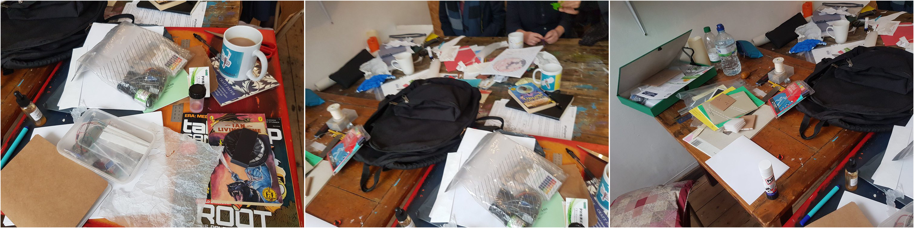
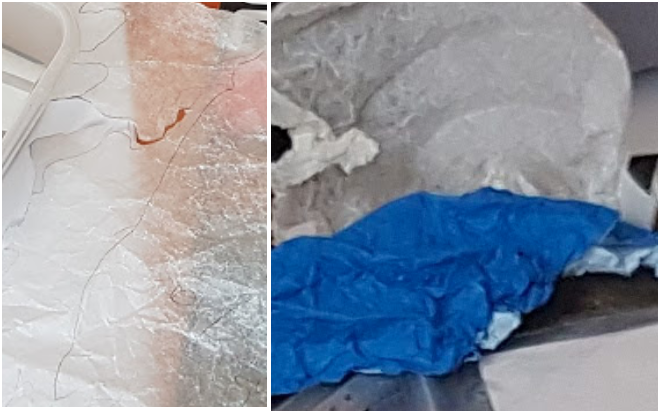
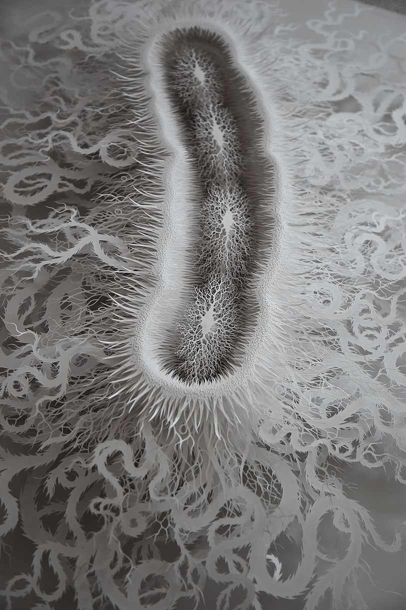

# PaperJam

Papercrafting maps & stories for non-humans, knitting microbiology and biodiversity back into the social

A group of artists, biodiversity researchers designers  and paper enthusiasts will be meeting monthly to jam and experiment on paper through crumpled situated storied folding human and non-humans together around Morecambe Bay.

Date|Venue|people|focus
---|---|---|---|
10 May 2019|[The Exchange CIC](https://www.theexchangecic.co.uk/)|Ross Dalziel, [Glenn Boulter](http://glennboulter.net/), [Claire Dean](http://www.clairedean.co.uk/), [Liz Edwards](https://twitter.com/hwLiz), [Hwa Young Jung](http://slyrabbit.net) and Serena Pollastri|Introductions & ideas

This repository is for interesting links elsewhere, possible project management and resources for papercrafting

## What we did

We shared some of our paper interests:

Claire on how she focuses on the materialism of writing; what and how and where we write matters

Glenn's training as a printmaker and love of simple books you can make with folds and sewing. We especially liked his handmade book about his friend who was a karaoke Freddie Mercury

Liz and her conductive inks-sound tableaus with schoolchildren looking at BioDiversity in the bay.

Hwa Young Jung on her gamemaking and relationship with origami.

Ross likes embedding in spaces to take part in the culture; hackspaces or more recently biology labs. The importance of crafting as a space making activity for talking and thinking

Below is a list or materials or techniques we either mentioned, had a go at or brought samples of

The next meeting will have a more defined focus lead by one of us and we will choose a venue that was somehow related to whatever focus the group member. Thanks to Liz for organising the Exchange!

## Materials and Samples

### Bio Diversity Board games

After looking at Hwa Young's [Probationary](http://probationary.co.uk/) and Rod Dillon & colleagues [Parasite-in-a-box](https://www.lancaster.ac.uk/working-with-schools/school-university-research-engagement/research-in-a-box/parasites-in-a-box/) would be nice to think of some board games about biodiversity. Claire is having to learn how to play Dungeons & Dragons, so maybe a biodiversity RPG is a good idea. Hwa Young had the idea of parlour games for the anthropocene; my Soilscape game hack of glenn's Wray Castle game could fit nicely ;) Gaia McGaia Face
### Cellulose

(C6H10O5)n

1000s of polymer chains make up the cellulose fibres mashed up into paper. Worth looking into some of the science in Chromatography

### Chromatography

Ross & Claire both like the idea of drawing water up into paper structures.

The principle of [Paper Chromatography](https://www.chemguide.co.uk/analysis/chromatography/paper.html) is not far from our `pH` litmus paper

### Crumpling

Claire showed us how to use slightly waxy paper that could be intensley crumpled into sculptural shapes

### Embossing

Simple writing and drawing into soft thick paper stock makes a nice feel to paper

### Microfluidics

Ross is exploring DIY practices in microfluidics. He's been looking at a brilliant [blog by Liz Tsai](http://fab.cba.mit.edu/classes/S62.12/people/tsai.liz/index.html) and the [Science Practice](https://www.science-practice.com/about/) blogpost on [DIY microfluidics experiments](https://www.science-practice.com/blog/2015/01/29/low-tech-microfluidics/).

These two posts contain alot of stuff to work on and Ross is using alot of the techniques in his research on kit-culture in bioscience.

### Paper viruses

Liz showed us some image of [Rogan Browns](https://roganbrown.com) laser cut hand assembled images inspired by the microbiological

### Sound recording
Liz's interfaces with [bare conductive boards](https://www.bareconductive.com/shop/touch-board/) with school children to record and playback the bird calls from birds in the bay onto a printed backdrop of the shoreline.

### Perforated Maps
Serena has made some really nice perforated maps. Ive been using the [DoESLiverpool Vinyl Cutter](https://github.com/DoESLiverpool/somebody-should/wiki/RolandVinylCutter) to cut into maps so will try seeing how to do that.

My friend Sean had idea of getting maps of changing coastlines and allow people to tear of the coast that might be disappearing.

## Polychronic objects
Liz talked about artist Jane Norris' work on making objects that fuse materials together

[MAKING POLYCHRONIC OBJECTS FOR A NETWORKED SOCIETY](https://www.drs2016.org/251)

Claire and I realised making structures with different papers with various hydrophobic, absorbant, folding, chromagraphic, conductive properties could be an interesting approach

### Water soluble Maps

### Wax Paper
